# RocoTools 工程架构设计图

> 最后更新：2026-05-24
> 本文档使用 Mermaid 语法，可在 GitHub / VS Code / 任何支持 Mermaid 的 Markdown 渲染器中查看。

---

## 1. 系统整体架构（C4 Context）

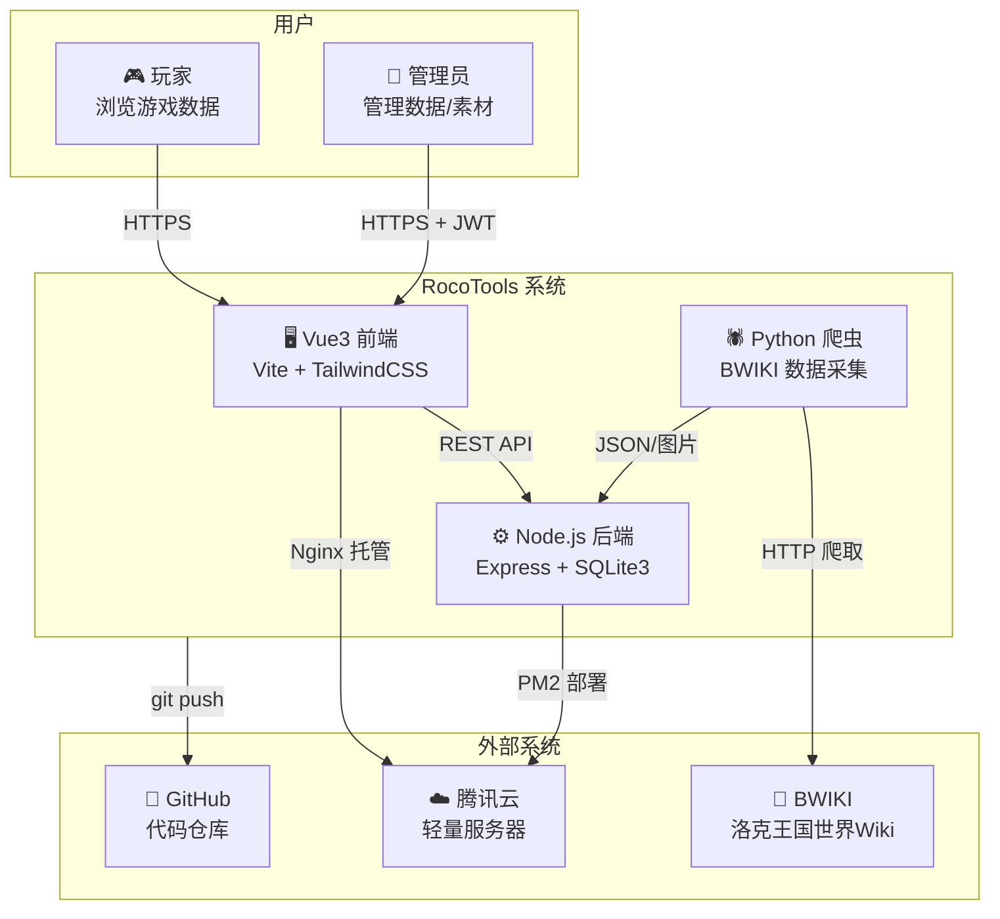

---

## 2. 技术栈分层架构

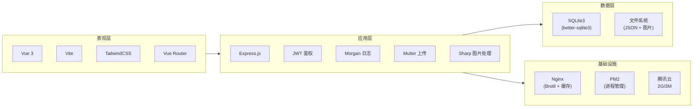

---

## 3. 目录结构总览

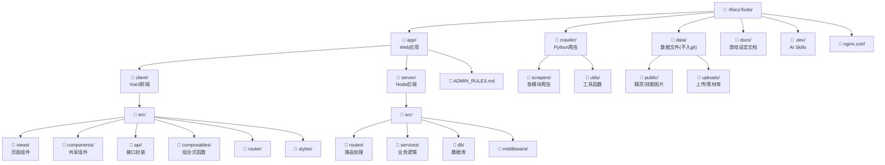

---

## 4. 数据流架构

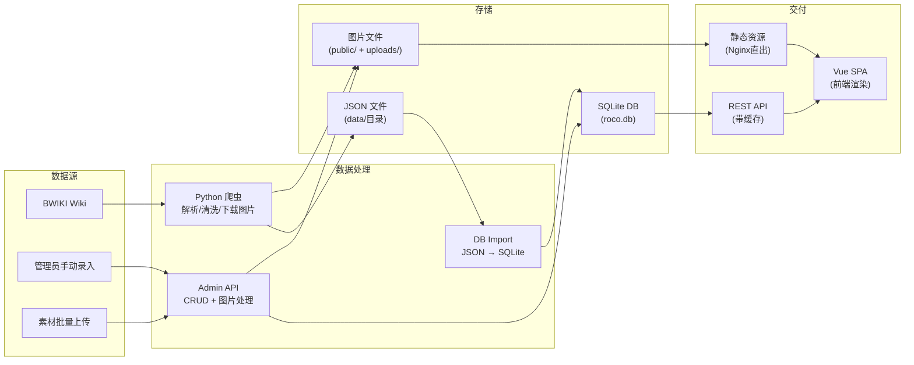

---

## 5. 数据库 ER 图

```mermaid
erDiagram
    elements {
        int id PK
        text key UK
        text name
        text color
        text icon
        text strong_against "JSON"
        text resisted_by "JSON"
        text weak_to "JSON"
        text resistant_to "JSON"
    }

    skills {
        text uid PK
        text name
        int element_id FK
        text category
        int cost
        int power
        text description
        int manual_edit
    }

    pets {
        text uid PK
        text pet_id
        text name
        int element_id FK
        int sub_element_id FK
        text ability_name
        int hp
        int speed
        int atk
        int matk
        int def
        int mdef
        int total
        int manual_edit
    }

    pet_details {
        text pet_uid PK_FK
        text image_default
        text image_shiny
        text image_fruit
        text image_egg
        text evolution_chain "JSON"
        int manual_edit
    }

    pet_skills {
        int id PK
        text pet_uid FK
        text skill_type
        text level
        text name
        text skill_ref_uid FK
    }

    egg_groups {
        int id PK
        text name UK
    }

    pet_egg_groups {
        text pet_uid PK_FK
        int egg_group_id PK_FK
    }

    natures {
        int id PK
        text name UK
        text stat_up
        text stat_down
        text sub_natures "JSON"
    }

    seasons {
        text id PK
        text name
        int is_current
        text pass_pets "JSON"
        text legend_pet
        text season_pets "JSON"
        text shiny_pets "JSON"
    }

    season_events {
        int id PK
        text season_id FK
        text category
        text name
        text pet_uid FK
        text start_date
        text end_date
    }

    pika_monthlies {
        int id PK
        text period
        text name
        text concept_male
        text concept_female
    }

    pika_monthly_pets {
        int id PK
        int monthly_id FK
        text pet_uid
        text locke_male
        text locke_female
    }

    variants_map {
        text pet_id PK
        text pet_uid PK_FK
        int sort_order
    }

    nav_tabs {
        int id PK
        text tab_key UK
        text label
        text route
        text parent_key
        int is_visible
        int sort_order
    }

    elements ||--o{ skills : "element_id"
    elements ||--o{ pets : "element_id"
    pets ||--|| pet_details : "pet_uid"
    pets ||--o{ pet_skills : "pet_uid"
    skills ||--o{ pet_skills : "skill_ref_uid"
    pets ||--o{ pet_egg_groups : "pet_uid"
    egg_groups ||--o{ pet_egg_groups : "egg_group_id"
    pets ||--o{ variants_map : "pet_uid"
    seasons ||--o{ season_events : "season_id"
    pika_monthlies ||--o{ pika_monthly_pets : "monthly_id"
```

---

## 6. 前端路由与页面结构

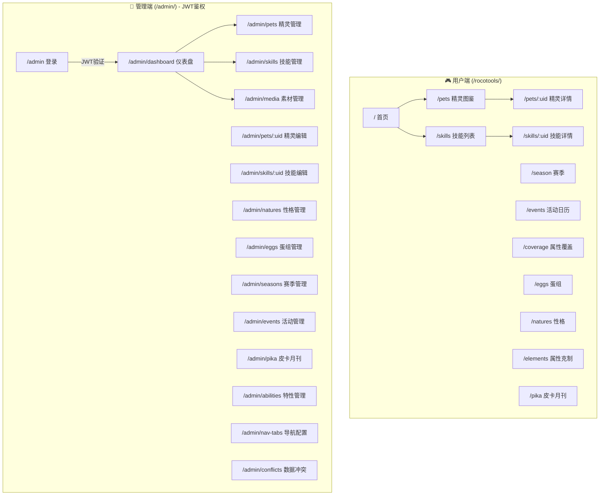

---

## 7. 后端 API 路由结构

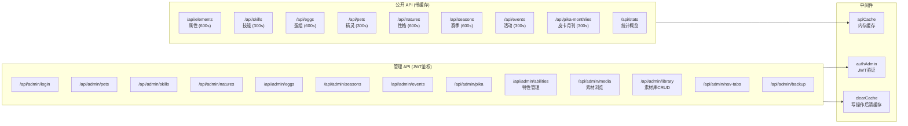

---

## 8. 爬虫模块结构

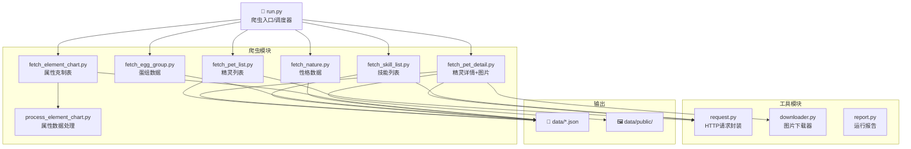

---

## 9. 部署架构

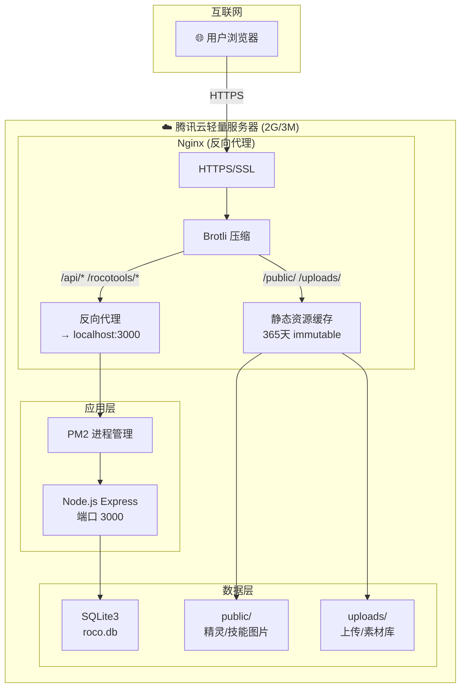

---

## 10. 素材管理模块详细流程

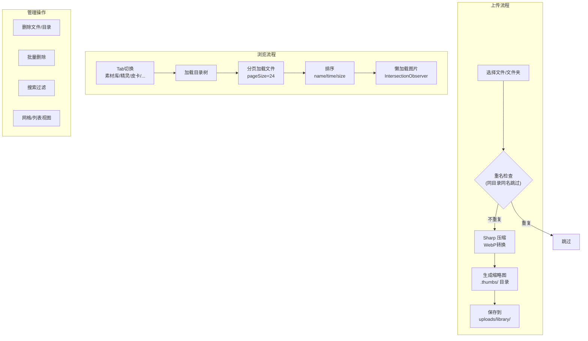

---

## 11. 核心数据关系概览

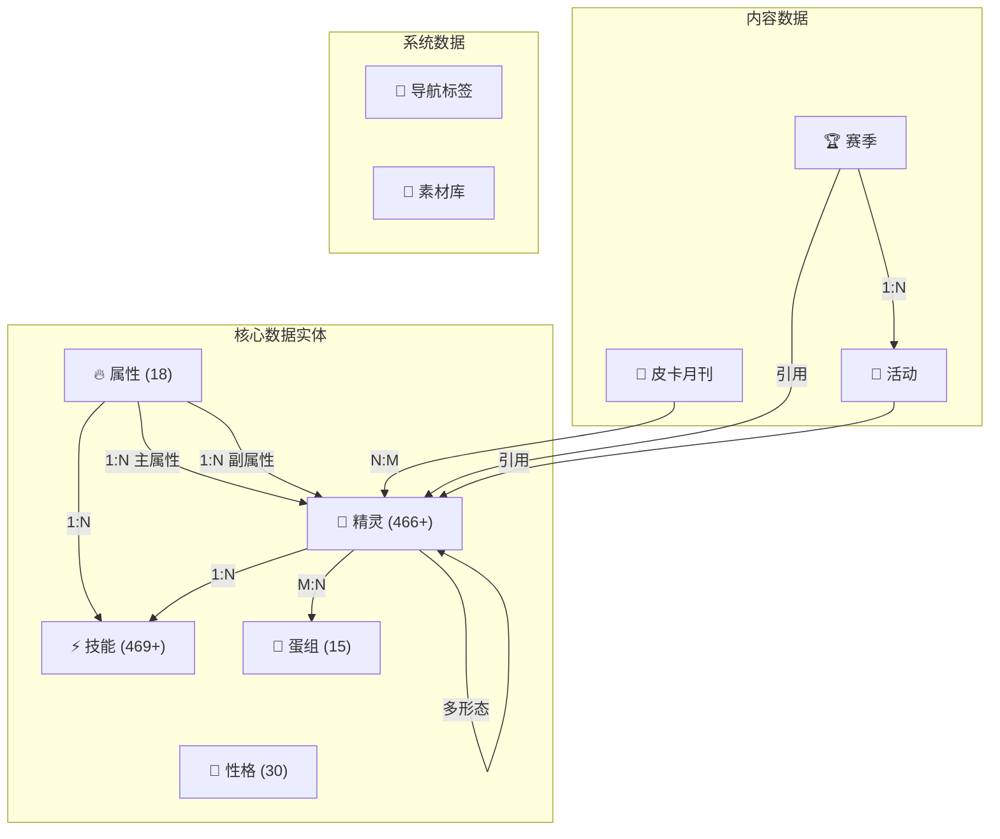

---

## 12. 前端共享组件依赖

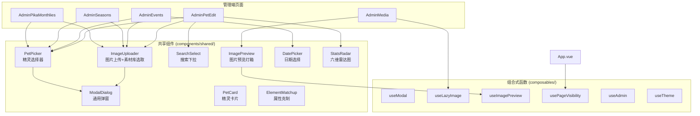

---

## 图例说明

| 符号 | 含义 |
|------|------|
| `PK` | 主键 |
| `FK` | 外键 |
| `UK` | 唯一键 |
| `1:N` | 一对多关系 |
| `M:N` | 多对多关系 |
| `JSON` | 字段存储为JSON字符串 |

---

## 快速导航

- **整体架构** → 第1节
- **技术栈** → 第2节
- **目录结构** → 第3节
- **数据流** → 第4节
- **数据库设计** → 第5节
- **前端路由** → 第6节
- **API结构** → 第7节
- **爬虫模块** → 第8节
- **部署架构** → 第9节
- **素材管理** → 第10节
- **数据关系** → 第11节
- **组件依赖** → 第12节
